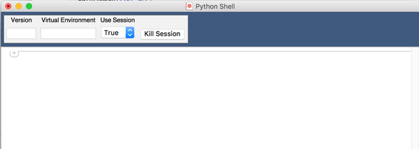
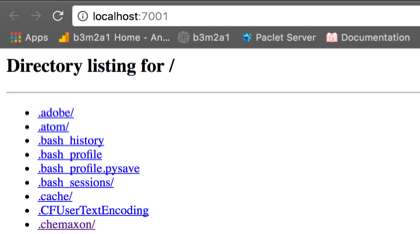

<a id="pytools" style="width:0;height:0;margin:0;padding:0;">&zwnj;</a>

# PyTools

This is an application for working with python processes. It provides a basic, extensible framework for generating python sessions, running python code, and a few utilities based on these.

---

<a id="installation" style="width:0;height:0;margin:0;padding:0;">&zwnj;</a>

# Installation

The easiest way to install this package is using a paclet server installation:

```mathematica
 PacletInstall[
 "PyTools",
 "Site"->
  "http://www.wolframcloud.com/objects/b3m2a1.paclets/PacletServer"
 ]
```

If you’ve already installed it you can update using:

```mathematica
 PacletUpdate[
 "PyTools",
 "Site"->
  "http://www.wolframcloud.com/objects/b3m2a1.paclets/PacletServer"
 ]
```

Alternately you can download this repo as a ZIP file and put extract it in  ```$UserBaseDirectory/Applications```

The application supports a few core pieces of functionality:

---

<a id="python-core" style="width:0;height:0;margin:0;padding:0;">&zwnj;</a>

## Python Core

### Packages

* [PyTools](Packages/PyTools.m)

* [Sessions](Packages/Sessions/Sessions.m)

* [SymbolicPython](Packages/Symbolic/SymbolicPython.m)

* [Script](Packages/Sessions/Script.m)

### Description

This is the heart of the framework. A  [```ProcessObject```](https://reference.wolfram.com/language/ref/ProcessObject.html)  corresponding to a python interpreter or the  [```$SystemShell```](https://reference.wolfram.com/language/ref/%24SystemShell.html)  can be generated and code can be passed to it to run with a convenient polling mechanism to make sure it hasn’t crashed.

The core function for using the framework is  ```PyRun```  which hooks up the sessions, code generation, and scripts interfaces. The  [Sessions](Packages/Sessions/Sessions.m)  package provides access to the underlying session config, the  [SymbolicPython](Packages/Symbolic/SymbolicPython.m)  package provides an interface for generating symbolic representations of python code, and the  [Script](Packages/Sessions/Script.m)  package provides an interface for using python-side scripts to facilitate communication between the sides.

### Examples

Here’s a very basic example of running some code:

```mathematica
 PyRun[Print["I am a llama"]]
```

	(*Out:*)
	
	"I am a llama"

We’ll go one step further and import something on the python side to be used in a session and using a specific python version:

```mathematica
 PyRun[
 Import["numpy"];
 myarr=numpy.array[{1,2,3}];
 myarr,
 "Version""3.4", 
 "UseSession"True
 ]
```

	(*Out:*)
	
	"array([1, 2, 3])"

We’ll note that we can now use this  ```myarr```  object elsewhere in that session. Here we’ll take 10 of its properties at random

```mathematica
 PyRun[
 Return[dir@myarr],
 "Version""3.4", 
 "UseSession"True
 ]//RandomSample[#,10]&
```

	(*Out:*)
	
	{"__or__","choose","__repr__","itemset","__getitem__","__isub__","transpose","__iter__","__float__","__ixor__"}

The  ```Return```  keyword at the end of the code block tells the package to try to import that result as a Mathematica expression. Note that using sessions is much faster than running a bunch of stand-alone code, once the session has been initialized:

```mathematica
(*With session*) 
 PyRun[
 Import["numpy"],
 "Version""3.4", 
 "UseSession"True
 ]//AbsoluteTiming//First
```

	(*Out:*)
	
	0.016188`

```mathematica
(*Without session*) 
 PyRun[
 Import["numpy"],
 "Version""3.4"
 ]//AbsoluteTiming//First
```

	(*Out:*)
	
	0.389223`

We can view properties of this session using the framework in the  [Sessions](Packages/Sessions/Sessions.m)  package:

```mathematica
 Needs["PyTools`Sessions`"]; 
 PySessions[]
```

	(*Out:*)
	


The framework provides much more control over sessions, but we won’t delve into that here.

The code  ```PyRun```  is actually sending to the session is generally generated via the   [SymbolicPython](Packages/Symbolic/SymbolicPython.m)  package. (you can see the code it’s building via the  ```"EchoCode"```  parameter). Let’s take a look at what that does:

```mathematica
 Needs["PyTools`Symbolic`"]; 
 ToSymbolicPython[
 Module[{x},
  Import["numpy"];
  Print[x]
  ]
 ]
```

	(*Out:*)
	
	PyLambda[PySymbol["x"]][{PyImport["numpy"],PyPrint[PySymbol["x"]]}]

We can see it builds up a symbolic representation of the code we sent it. Many things are supported (but obviously even more are not). This symbolic representation can then be marshalled down to a string via  ```ToPython``` .

```mathematica
 ToSymbolicPython[
 Module[{x},
  Import["numpy"];
  Print[x]
  ]
 ]//ToPython
```

	(*Out:*)
	
	"( lambda x: (\n\timport numpy,\n\tprint(x),\n\t)[-1]\n )"

To effectively use this requires good knowledge of python and Mathematica, as the syntax is generally a mixture of python structures, Mathematica structures, and some judgement calls. For instance,  ```Module```  is being treated as an anonymous  ```lambda```  function which scopes its parameter. Other things have more direct translations:

```mathematica
 ToSymbolicPython[
 Map[Print, Range[10]]
 ]//ToPython
```

	(*Out:*)
	
	"list(map(print, range(10)))"

Other things that perhaps look like more Mathematica code are translated to their python equivalents:

```mathematica
 ToSymbolicPython[
 Insert[$Path, my$dir, 0]
 ]//ToPython
```

	(*Out:*)
	
	"import sys\nsys.path.insert(0, my_dir)\n"

The rules underlying this will be documented if there is sufficient demand for it.

The script interface makes it easier to write python-side scripts for in python code. It simply provides a loader interface for those. It also provides an export system, which is used by  ```PyRun```  when the final value is wrapped in  ```Return``` . Currently export always route to JSON for serialization, but for other data-types (e.g. pandas data frames) other exporters will be written. An import framework will be added in the future.

A quick example of how this works:

```mathematica
 PyRun[
 Import["numpy"];
 arr = numpy.array[Range[10]];
 Return[list[arr + arr]],
 "Version""3.4",
 "UseSession"True
 ]
```

	(*Out:*)
	
	{0,2,4,6,8,10,12,14,16,18}

A python  ```list```  can (generally) be serialized to JSON, so it can be imported back into Mathematica as a list. A future export rule might add support for taking a  ```numpy.array```  and sending it through as a list. 

Big data automatically routes through a temporary file. For example:

```mathematica
 PyRun[
 Import["numpy"];
 arr = numpy.random.rand[100, 100];
 Return@Map[list,arr],
 "Version""3.4",
 "UseSession"True
 ]//Short
```

	(*Out:*)
	


---

<a id="python-shell" style="width:0;height:0;margin:0;padding:0;">&zwnj;</a>

## Python Shell

### Stylesheets

* [PythonShell](FrontEnd/StyleSheets/PyTools/PythonShell.nb)

### Description

The  [PythonShell](FrontEnd/StyleSheets/PyTools/PythonShell.nb)  stylesheet provides a shell-like interface to the python interface. A new one can be made like so:

```mathematica
 PyNewShell[]
```

	(*Out:*)
	
	NotebookObject[]



This interface uses  ```PyRun```  naturally, allowing us to easily do things like this:


(Note that  ```Return```  in this context simply tells  ```PyRun```  to apply export scripts rather than passing the string representation through)

---

<a id="python-utilities" style="width:0;height:0;margin:0;padding:0;">&zwnj;</a>

## Python Utilities

### Packages

* [PyServer](Packages/Utilities/PyServer.m)

### Description

The core use of this package will be to expand the basic framework by adding a collection of utilities. For now, there is only one utility, which is an interface to the  ```SimpleHTTPServer```  module. More utilities will be added as time permits.

### Examples

The current sole utility is an HTTP server:

```mathematica
 Needs["PyTools`Utilities`"]; 
 PyServerOpen[Directory[]]
```

